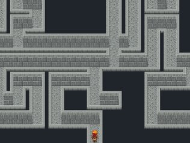
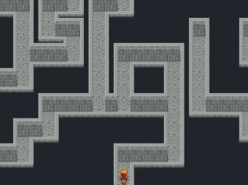

Random Map Generator (v 0.51)
===

This script dynamically transforms a blank map into a fully-drawn one using its current tileset (and keeping any events that may have been placed).  It accomplishes this by randomly generating an underlying structure (in this case a maze, though other generation algorithms are planned) and then individually placing the appropriate tiles to create the map.

The generation algorithm can be guided by certain parameters, and tile selection is fully customizable (even autotiles).  Of course, this all happens invisibly; the player should experience no delays.  Finally, using (a slight modification of) Near Fantastica's Dynamic Maps script, the randomly generated map can be saved (remain the same when returned to by the player) or left random so that every visit results in a different map.






Sample uses:

* Mazes
   * Interior, using regular walls or objects (see demo)
   * Exterior, using water/hedges/cliffs etc
* Building interiors (who wants to do each NPC building in a city by hand? :P )
* Minigames, perhaps resembling Rogue or Nethack (see demo)


Demo
---
See `demo` directory. Requires RMXP, of course.


Installation
---
Copy the script in `src`, and open the Script Editor within RMXP. At the bottom of the list of classes on the left side of the new window, you'll see one called "Main". Right click on it and select "Insert". In the newly created entry in the list, paste this script.


Usage
---

To indicate a map is to be randomly generated, include `<rand>` in its name.  You may also optionally specify custom randomness, sparsity and deadend removal parameters to guide how the map is generated (see comments within for more details).  These may also be included in the map name, as in this example: `XYZ <rand><0.8><5><0.8>` (from left to right, randomness, sparsity and deadend removal in that order).
  
Finally, the optional parameter `<save>` may immediately follow `<rand>` to indicate that the map should be generated randomly the first time but then saved and remain the same thereafter instead of randomizing again. This requires an additional script (see FAQ below).
  
Events are not erased on the map which will be randomly generated, but there is no way to guarantee they'll be positioned correctly. (The only exceptions to this are two events which determine the start and end of the maze.)
  
Place an event named `<start>` to specify a location you'd like the player to begin the maze (else a default is chosen). To avoid appearing inside a wall,  the start location should not be at any of the four corners of the map nor any tile where x is even or y is odd (exceptions occur along an edge of the map, i.e. when x=0, x=width-1, y=0 or y=height-1).  The diagram below may clarify, where discouraged starting points are marked with an X:

```  
  y\x 0  1  2  3  4  5  6  7  8  9 10 11 12 13 14 15 16 17 18 19
   0  X     X     X     X     X     X     X     X     X     X  X  
   1  X  X  X  X  X  X  X  X  X  X  X  X  X  X  X  X  X  X  X  X
   2        X     X     X     X     X     X     X     X     X
   3  X  X  X  X  X  X  X  X  X  X  X  X  X  X  X  X  X  X  X  X
   4        X     X     X     X     X     X     X     X     X
   5  X  X  X  X  X  X  X  X  X  X  X  X  X  X  X  X  X  X  X  X
   6        X     X     X     X     X     X     X     X     X
   7  X  X  X  X  X  X  X  X  X  X  X  X  X  X  X  X  X  X  X  X
   8        X     X     X     X     X     X     X     X     X
   9  X  X  X  X  X  X  X  X  X  X  X  X  X  X  X  X  X  X  X  X
  10        X     X     X     X     X     X     X     X     X
  11  X  X  X  X  X  X  X  X  X  X  X  X  X  X  X  X  X  X  X  X
  12        X     X     X     X     X     X     X     X     X
  13  X  X  X  X  X  X  X  X  X  X  X  X  X  X  X  X  X  X  X  X
  14  X     X     X     X     X     X     X     X     X     X  X
```
  
(These restrictions are unfortunate, but necessary.  Note as well that if you're not using a wall face then y SHOULD BE even.  Either way, you should get a warning message if you've placed a start/end incorrectly.)
   
If you want there to be a passage leading off the map, the start location must be placed on an edge (i.e. x=0, y=0, x=width-1 or y=height-1). Alternatively, the start and/or exit locations can be somewhere in the interior of the map... in this case the player arrives/exits by magic, falling, climbing, etc.
  
All the above also applies for the exit location, except the event is named `<end>`.  Again, a default end is chosen if one is not supplied.

Of course, if the player is to be able to exit the map from either of these two points, you must make the event teleport appropriately.
  
Also, the teleport into the maze should point at same square as the `<start>` event, or else you may get stuck in a wall.
  
You can specify which tiles to use for the floor, walls, etc in the Maze class (just add an appropriate 'elsif').

FAQ
---

> How can I make the generated map persist across saves?

You'll need Near Fantastica's Dynamic Maps script, but change Game_Map.setup to:

```ruby
class Game_Map
 #--------------------------------------------------------------
 # modified slightly: only certain maps are actually saved
 def setup(map_id)
   if $save_map_list.include? @map_id
     save_map(@map_id)
   end
   if Map.data(map_id) == nil
     setup_map(map_id)
   else
     load_map(map_id)
   end
 end
end
```

> I can't figure out how to use the parameters (randomness, sparsity and deadend removal)

If you want to specify them (they're optional), you include them in the map name, as in this example: `your-map-name <rand><1.8><5><0.8>` (from left to right, randomness, sparsity and deadend removal in that order).

* *Randomness* is the chance that a corridor will twist instead of continuing straight (decimal value between 0 and 1.0, default is 0.5).
* *Sparsity* represents the number of deadends to be shortened, creating empty spaces (integer value of 0 or more, default is 3). Note that a smaller maze will sparsify faster than a larger one, so for small mazes you'll want a small number.
* *Deadend removal* (or removalChance) is the chance for a deadend to be removed by connecting it (creating a loop) to a nearby one (decimal value between 0 and 1.0, default is 0.5). Note that this can create multiple solutions to the maze, but it m
ay also make the maze seem more natural.

So if you wanted very twisty mazes with no empty spaces or deadends, you'd name the map something like: `your-map-name <rand><1.0><0><1.0>`.  Spaces etc. between the tags shouldn't matter.


